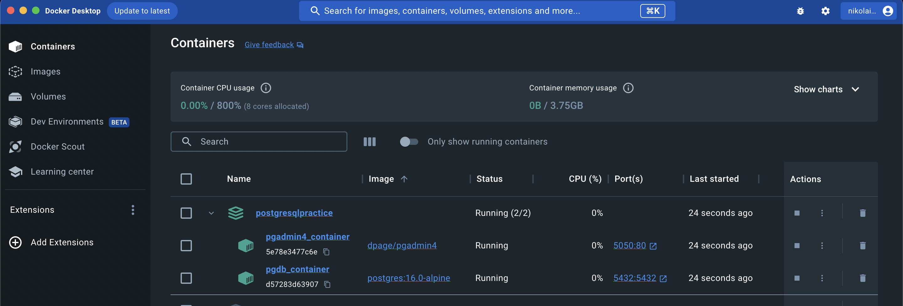
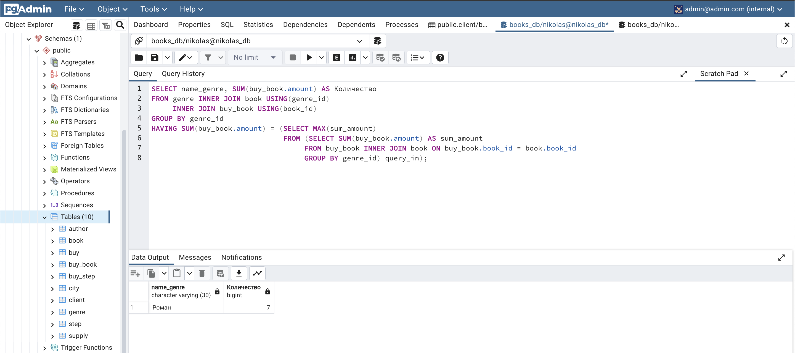

<!-- Improved compatibility of back to top link: See: https://github.com/othneildrew/Best-README-Template/pull/73 -->
<a name="readme-top"></a>
<!-- PROJECT LOGO -->
<div align="center">
  <h1 align="center">PostgreSQL + pgAdmin4</h1>
  <p align="center">
    Pet-project
      </p>
</div>

<!-- TABLE OF CONTENTS -->
<details>
  <summary>Оглавление</summary>
  <ol>
    <li>
      <a href="#О-проекте">О Проекте</a>
      <ul>
        <li><a href="#Использованые-инструменты-для-создания-проекта">Инструменты проекта</a></li>
      </ul>
    </li>
    <li>
      <a href="#Начало-работы">Начало работы</a>
      <ul>
        <li><a href="#Установка-и-запуск">Установка и запуск</a></li>
      </ul>
    </li>
    <li><a href="#Описание-и-процесс-работы">Описание и процесс работы</a></li>
    <li><a href="#Улучшения">Улучшения</a></li>
    <li><a href="#Контакты">Контакты</a></li>
    <li><a href="#Знания">Знания</a></li>
  </ol>
</details>


<!-- ABOUT THE PROJECT -->
## О проекте


Проект реализован для практики запросов в базу данных PosgreSQL.


Что создал в проекте:
- реализовал базу данных PosgreSQL + сервис администрирования и разработки баз данных PostgreSQL pgAdmin 4;
- запустил проект в Docker с помощью docker-compose файла;
- изучил функционал Github Actions;
- написал код для запуска контейнеров и создания базы данных в Github Actions;


<p align="right">(<a href="#readme-top">back to top</a>)</p>

<!-- ### Built With -->

### Использованые инструменты для создания проекта:


* [![Docker][Docker.dkr]][Docker-url]
* [![Postgres][Postgres.psg]][Postgres-url]
* [![GitHub_Actions][GitHub_Actions.gtac]][GitHub_Actions-url]
* [![VSCode][VSCode.vsc]][VSCode-url]
* [![YouTube][YouTube.yt]][YouTube-url]
* [![GitHub][GitHub.gth]][GitHub-url]


<p align="right">(<a href="#readme-top">back to top</a>)</p>


<!-- GETTING STARTED -->
## Начало работы

Чтобы запустить локальную версию проекта необходимо скачать себе командой:
   ```sh

$ git clone https://github.com/ForwardingAgent/PostgreSQL_tasks
   ```
Затем прописать в файле .env ваши данные для следующих переменных:

для Postgres:
- POSTGRES_DB=<ваши данные>
- POSTGRES_USER=<ваши данные>
- POSTGRES_PASSWORD=<ваши данные>

для pgadmin:
- PGADMIN_DEFAULT_EMAIL=<ваши данные (email)>
- PGADMIN_DEFAULT_PASSWORD=<ваши данные (password)>

### Установка и запуск

1. Для сборки всех сервисов запустите команду
   ```sh
   docker-compose build
    ```
2. Для запуска проекта запустите команду
   ```sh
   docker-compose up
   ```
3. Доступ к БД Postgres через pgAdmin4 по адресу
   ```sh
   http://localhost:5050
   ```
4. Для проверки Github Actions в docker-compose нужно закомментировать строки 'env_file:', т.к. Github Actions заполняет секретные данные из своих secrets.
   Заполнить свои данные в Github Actions-Secrets (POSTGRES_DB, POSTGRES_USER, POSTGRES_PASSWORD, PGADMIN_DEFAULT_EMAIL, PGADMIN_DEFAULT_PASSWORD).

<p align="right">(<a href="#readme-top">back to top</a>)</p>


<!-- USAGE EXAMPLES -->
## Описание и процесс работы


Данный проект запускается парой команд docker-compose build и docker-compose up, т.к. работает в контейнерах на платформе Docker.
Каждый элемент проекта запущен в своем контейнере (PostgreSQL, PgAdmin):




Доступ и управление базой данных Postgres осуществляется через интерфейс платформы pgAdmin:
Пример запроса:
Вывести жанр (или жанры), в котором было заказано больше всего экземпляров книг, указать это количество.
Последний столбец назвать Количество.





Ниже предоставлены данные для варианта создания и заполнения базы данных по схеме:


:point_down: <details>
   <summary>Данные для БД Book_Store в соответствии со схемой</summary>


    CREATE TABLE author (
        author_id SERIAL PRIMARY KEY,
        name_author VARCHAR(50)
    );

    CREATE TABLE genre (
        genre_id SERIAL PRIMARY KEY,
        name_genre VARCHAR(30)
    );

    CREATE TABLE book (
        book_id SERIAL PRIMARY KEY,
        title VARCHAR(50),
        author_id INT NOT NULL,
        genre_id INT,
        price DECIMAL(8, 2),
        amount INT,
        FOREIGN KEY (author_id)
            REFERENCES author (author_id)
            ON DELETE CASCADE,
        FOREIGN KEY (genre_id)
            REFERENCES genre (genre_id)
            ON DELETE SET NULL
    );

    CREATE TABLE city (
        city_id SERIAL PRIMARY KEY,
        name_city VARCHAR(30),
        days_delivery INT
    );

    CREATE TABLE client (
        client_id SERIAL PRIMARY KEY,
        name_client VARCHAR(50),
        city_id INT,
        email VARCHAR(30),
        FOREIGN KEY (city_id) REFERENCES city (city_id)
    );

    CREATE TABLE buy(
        buy_id SERIAL PRIMARY KEY,
        buy_description VARCHAR(100),
        client_id INT,
        FOREIGN KEY (client_id) REFERENCES client (client_id)
    );

    CREATE TABLE buy_book (
        buy_book_id SERIAL PRIMARY KEY,
        buy_id INT,
        book_id INT,
        amount INT,
        FOREIGN KEY (buy_id) REFERENCES buy (buy_id),
        FOREIGN KEY (book_id) REFERENCES book (book_id)
    );

    CREATE TABLE step (
        step_id SERIAL PRIMARY KEY,
        name_step VARCHAR(30)
    );

    CREATE TABLE buy_step (
        buy_step_id SERIAL PRIMARY KEY,
        buy_id INT,
        step_id INT,
        date_step_beg DATE,
        date_step_end DATE,
        FOREIGN KEY (buy_id) REFERENCES buy (buy_id),
        FOREIGN KEY (step_id) REFERENCES step (step_id)
    );

    INSERT INTO author (author_id, name_author)
    VALUES (1, 'Булгаков М.А.'),
        (2, 'Достоевский Ф.М.'),
        (3, 'Есенин С.А.'),
        (4, 'Пастернак Б.Л.'),
        (5, 'Лермонтов М.Ю.');

    INSERT INTO genre(genre_id, name_genre)
    VALUES (1, 'Роман'),
        (2, 'Поэзия'),
        (3, 'Приключения');

    INSERT INTO book (book_id, title, author_id, genre_id, price, amount)
    VALUES  (1, 'Мастер и Маргарита', 1, 1, 670.99, 3),
            (2, 'Белая гвардия ', 1, 1, 540.50, 5),
            (3, 'Идиот', 2, 1, 460.00, 10),
            (4, 'Братья Карамазовы', 2, 1, 799.01, 2),
            (5, 'Игрок', 2, 1, 480.50, 10),
            (6, 'Стихотворения и поэмы', 3, 2, 650.00, 15),
            (7, 'Черный человек', 3, 2, 570.20, 6),
            (8, 'Лирика', 4, 2, 518.99, 2);

    INSERT INTO city(city_id, name_city, days_delivery)
    VALUES (1, 'Москва', 5),
        (2, 'Санкт-Петербург', 3),
        (3, 'Владивосток', 12);

    INSERT INTO client(client_id, name_client, city_id, email)
    VALUES (1, 'Баранов Павел', 3, 'baranov@test'),
        (2, 'Абрамова Катя', 1, 'abramova@test'),
        (3, 'Семенонов Иван', 2, 'semenov@test'),
        (4, 'Яковлева Галина', 1, 'yakovleva@test');

    INSERT INTO buy (buy_id, buy_description, client_id)
    VALUES (1, 'Доставка только вечером', 1),
        (2, NULL, 3),
        (3, 'Упаковать каждую книгу по отдельности', 2),
        (4, NULL, 1);

    INSERT INTO buy_book(buy_id, book_id, amount)
    VALUES (1, 1, 1),
        (1, 7, 2),
        (1, 3, 1),
        (2, 8, 2),
        (3, 3, 2),
        (3, 2, 1),
        (3, 1, 1),
        (4, 5, 1);

    INSERT INTO step(step_id, name_step)
    VALUES (1, 'Оплата'),
        (2, 'Упаковка'),
        (3, 'Транспортировка'),
        (4, 'Доставка');

    INSERT INTO buy_step(buy_step_id, buy_id, step_id, date_step_beg, date_step_end)
    VALUES (1, 1, 1, '2020-02-20', '2020-02-20'),
        (2, 1, 2, '2020-02-20', '2020-02-21'),
        (3, 1, 3, '2020-02-22', '2020-03-07'),
        (4, 1, 4, '2020-03-08', '2020-03-08'),
        (5, 2, 1, '2020-02-28', '2020-02-28'),
        (6, 2, 2, '2020-02-29', '2020-03-01'),
        (7, 2, 3, '2020-03-02', NULL),
        (8, 2, 4, NULL, NULL),
        (9, 3, 1, '2020-03-05', '2020-03-05'),
        (10, 3, 2, '2020-03-05', '2020-03-06'),
        (11, 3, 3, '2020-03-06', '2020-03-10'),
        (12, 3, 4, '2020-03-11', NULL),
        (13, 4, 1, '2020-03-20', NULL),
        (14, 4, 2, NULL, NULL),
        (15, 4, 3, NULL, NULL),
        (16, 4, 4, NULL, NULL);
</details>


<p align="right">(<a href="#readme-top">back to top</a>)</p>


<!-- CONTRIBUTING -->
## Улучшения

Всегда открыт к новым идеям и знаниям.

1. Создайте собственную копию проекта Fork the Project
2. Создать новую ветку (`git checkout -b feature/AmazingFeature`)
3. Создайте коммит (`git commit -m 'Add some AmazingFeature'`)
4. Запуште (`git push origin feature/AmazingFeature`)
5. Отправьте обновления в вашу ветку Open a Pull Request

<p align="right">(<a href="#readme-top">back to top</a>)</p>


<!-- CONTACT -->
## Контакты

Email - npodkopaev@gmail.com

Ссылка на проект: [https://github.com/ForwardingAgent/PostgreSQL_tasks](https://github.com/ForwardingAgent/PostgreSQL_tasks)

<p align="right">(<a href="#readme-top">back to top</a>)</p>


<!-- ACKNOWLEDGMENTS -->
## Знания

Некоторые ресурсы которые помогли в создании сайта:

* [GitHub Emoji Cheat Sheet](https://www.webpagefx.com/tools/emoji-cheat-sheet)
* [Malven's Flexbox Cheatsheet](https://flexbox.malven.co/)
* [Malven's Grid Cheatsheet](https://grid.malven.co/)
* [Img Shields](https://shields.io)
* [GitHub Pages](https://pages.github.com)


<p align="right">(<a href="#readme-top">back to top</a>)</p>


<!-- MARKDOWN LINKS & IMAGES -->
<!-- https://www.markdownguide.org/basic-syntax/#reference-style-links -->
[contributors-shield]: https://img.shields.io/github/contributors/othneildrew/Best-README-Template.svg?style=for-the-badge
[contributors-url]: https://github.com/othneildrew/Best-README-Template/graphs/contributors
[forks-shield]: https://img.shields.io/github/forks/othneildrew/Best-README-Template.svg?style=for-the-badge
[forks-url]: https://github.com/othneildrew/Best-README-Template/network/members
[stars-shield]: https://img.shields.io/github/stars/othneildrew/Best-README-Template.svg?style=for-the-badge
[stars-url]: https://github.com/othneildrew/Best-README-Template/stargazers
[issues-shield]: https://img.shields.io/github/issues/othneildrew/Best-README-Template.svg?style=for-the-badge
[issues-url]: https://github.com/othneildrew/Best-README-Template/issues
[license-shield]: https://img.shields.io/github/license/othneildrew/Best-README-Template.svg?style=for-the-badge
[license-url]: https://github.com/othneildrew/Best-README-Template/blob/master/LICENSE.txt
[linkedin-shield]: https://img.shields.io/badge/-LinkedIn-black.svg?style=for-the-badge&logo=linkedin&colorB=555
[linkedin-url]: https://linkedin.com/in/othneildrew


[product-screenshot]: images/screenshot.png
[VSCode.vsc]: https://img.shields.io/badge/Visual%20Studio%20Code-0078d7.svg?style=for-the-badge&logo=visual-studio-code&logoColor=white
[VSCode-url]: https://code.visualstudio.com

[Python.py]: https://img.shields.io/badge/python-3670A0?style=for-the-badge&logo=python&logoColor=ffdd54
[Python-url]: https://www.python.org

[Django.dj]: https://img.shields.io/badge/django-%23092E20.svg?style=for-the-badge&logo=django&logoColor=white
[Django-url]: https://www.djangoproject.com


[Sqlite.sq]: https://img.shields.io/badge/sqlite-%2307405e.svg?style=for-the-badge&logo=sqlite&logoColor=white
[Sqlite-url]: https://www.sqlite.org/index.html

[YouTube.yt]: https://img.shields.io/badge/YouTube-%23FF0000.svg?style=for-the-badge&logo=YouTube&logoColor=white
[YouTube-url]: https://www.youtube.com


[Postgres.psg]: https://img.shields.io/badge/postgres-%23316192.svg?style=for-the-badge&logo=postgresql&logoColor=white
[Postgres-url]: https://www.postgresql.org

[Redis.rds]: https://img.shields.io/badge/redis-%23DD0031.svg?style=for-the-badge&logo=redis&logoColor=white
[Redis-url]: https://redis.io

[Docker.dkr]: https://img.shields.io/badge/docker-%230db7ed.svg?style=for-the-badge&logo=docker&logoColor=white
[Docker-url]: https://www.docker.com

[GitHub.gth]: https://img.shields.io/badge/github-%23121011.svg?style=for-the-badge&logo=github&logoColor=white
[GitHub-url]: https://github.com

[GitHub_Actions.gtac]: https://img.shields.io/badge/github%20actions-%232671E5.svg?style=for-the-badge&logo=githubactions&logoColor=white
[GitHub_Actions-url]: https://github.com/features/actions

[Svelte.dev]: https://img.shields.io/badge/Svelte-4A4A55?style=for-the-badge&logo=svelte&logoColor=FF3E00
[Svelte-url]: https://svelte.dev/
[Laravel.com]: https://img.shields.io/badge/Laravel-FF2D20?style=for-the-badge&logo=laravel&logoColor=white
[Laravel-url]: https://laravel.com
[Bootstrap.com]: https://img.shields.io/badge/Bootstrap-563D7C?style=for-the-badge&logo=bootstrap&logoColor=white
[Bootstrap-url]: https://getbootstrap.com
[JQuery.com]: https://img.shields.io/badge/jQuery-0769AD?style=for-the-badge&logo=jquery&logoColor=white
[JQuery-url]: https://jquery.com

